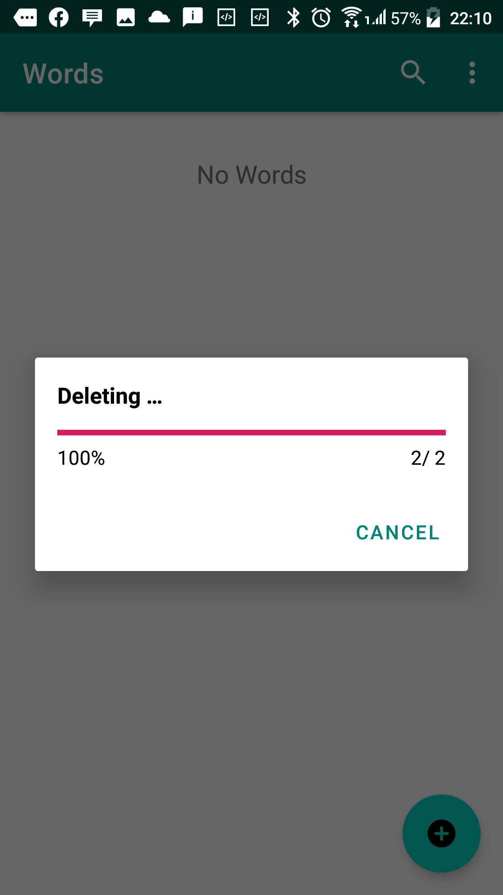

<p align="center"></p>
  
# Room New Learnt Word Android Kotlin

Minimum Android Version 5.0 (Lollipop)

#### PS
	Used Kotlin coroutines delay function to simulate long running tasks
	
### Demos
#### Adding a word


	


	
#### Updating a word


	
#### Deleting a word


	
#### Searching a non-existing word and all words display


	
#### Searching for an existing word and delete all words option


	
#### Showing action mode on long press when search view is closed and showing floating context menu on long press when search view is opened


	
#### Deleting word/ words progress bar and deleting word/ words cancelled


	
#### Swipe down to refresh


## License

MIT License

```Copyright (c) 2020 fortie40

Permission is hereby granted, free of charge, to any person obtaining a copy
of this software and associated documentation files (the "Software"), to deal
in the Software without restriction, including without limitation the rights
to use, copy, modify, merge, publish, distribute, sublicense, and/or sell
copies of the Software, and to permit persons to whom the Software is
furnished to do so, subject to the following conditions:

The above copyright notice and this permission notice shall be included in all
copies or substantial portions of the Software.

THE SOFTWARE IS PROVIDED "AS IS", WITHOUT WARRANTY OF ANY KIND, EXPRESS OR
IMPLIED, INCLUDING BUT NOT LIMITED TO THE WARRANTIES OF MERCHANTABILITY,
FITNESS FOR A PARTICULAR PURPOSE AND NONINFRINGEMENT. IN NO EVENT SHALL THE
AUTHORS OR COPYRIGHT HOLDERS BE LIABLE FOR ANY CLAIM, DAMAGES OR OTHER
LIABILITY, WHETHER IN AN ACTION OF CONTRACT, TORT OR OTHERWISE, ARISING FROM,
OUT OF OR IN CONNECTION WITH THE SOFTWARE OR THE USE OR OTHER DEALINGS IN THE
SOFTWARE.
